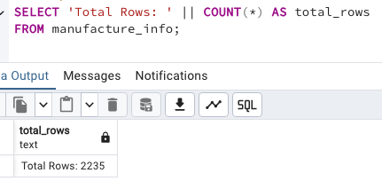

# Puppertier Webscraping automation

## Links

the website:
https://buykorea.org/cp/cpy/selectCompaniesList.do

example manufacture:
https://buykorea.org/seller-home/1165285

example product pages:
https://buykorea.org/ec/prd/selectGoodsDetail.do?goodsSn=3726131&inFlowCd=S

## Data type

### Structure

### Numbers in total

#### manufacture_info

#### product_info

<!--  -->

#### product_images

<!--  -->

## Run the script

`node + script_name`

# Common commands

### Log into postgres local

`psql -U postgres -d postgres`

### dump to backup and restore

dump:

restore:
